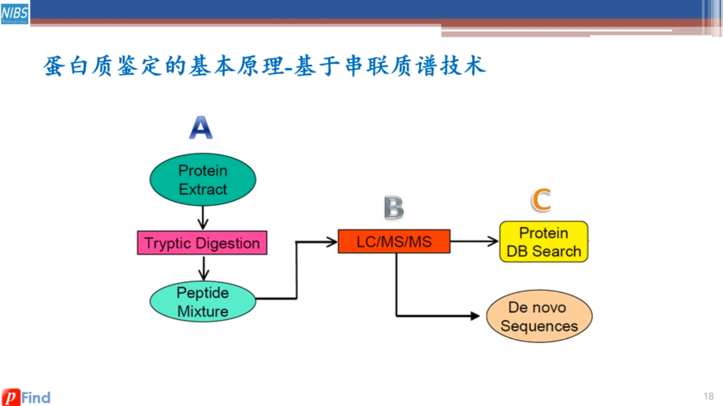
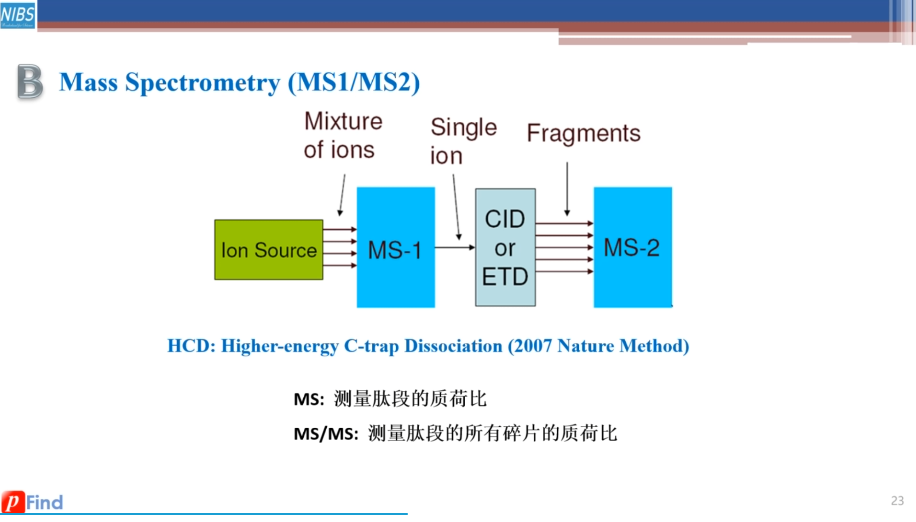
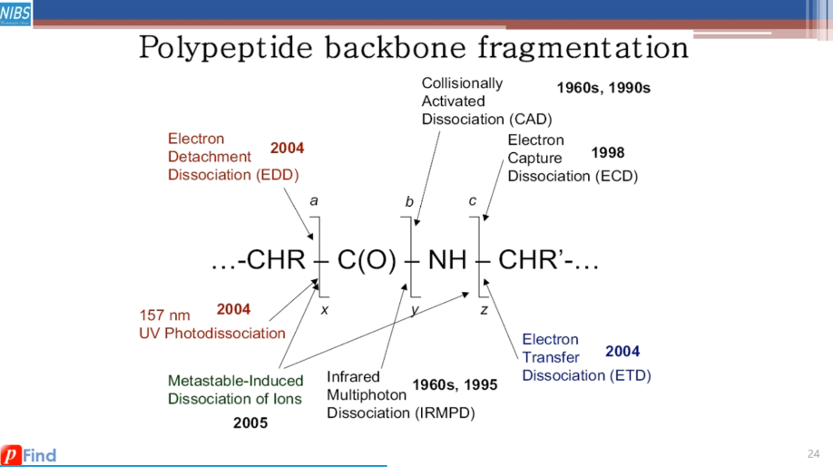
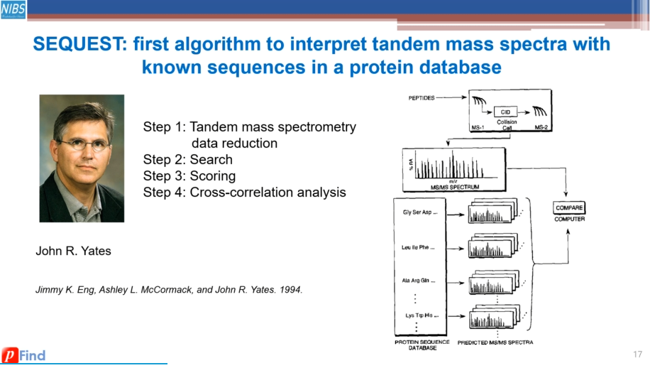
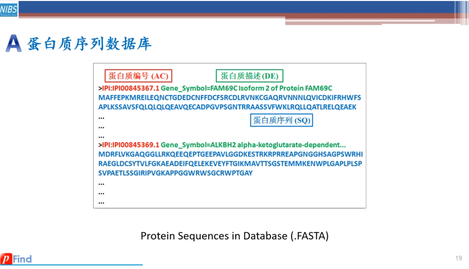
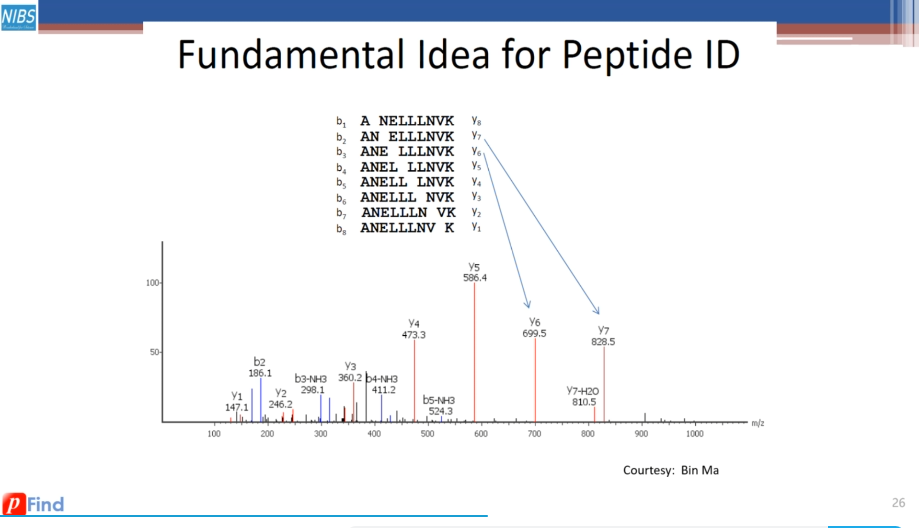
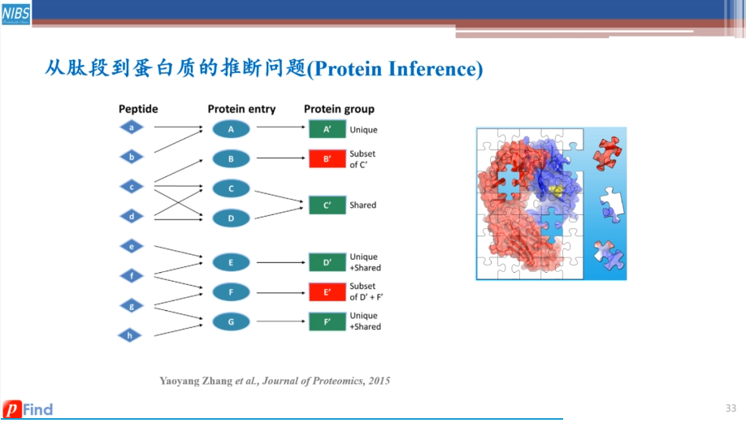
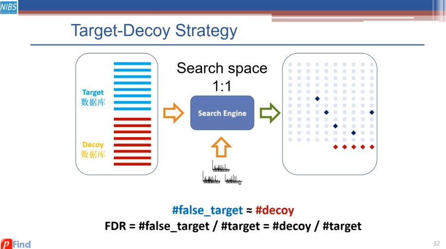

# Background Knowledge

### Definitions in mass spectrometry

What is the typical procedure for the identification of a protein sample?

>

What is MS-1 & MS-2 (MS/MS)? How are they generated in Liquid Chromatography Triple Quadrupole Mass Spectrometry (LC MS/MS)?

>

What is the definition of fragment ions abcxyz?

>

### Main ideas of pepide identification (database search approach)

What is the brief procedure for a protein database search engine to identify MS/MS data?

>

How to interpret the text in fasta file? How is fasta file turned into peptide candidates?

> 
Fasta file is consequently turned into peptide candidates by *in silico* splicing within search engines.

Given a sequence, how to label peaks in a MS/MS spectrum?

>

How to interfer the existence of a protein from peptides?

>

Why control False Discovery Rate (FDR)? How do Target-Decoy Approach (TDA) control FDR?

>

How does open search mode different from restricted search in a user's view?

> Users do not need to restrict parameters such as splicing type and modifications.
