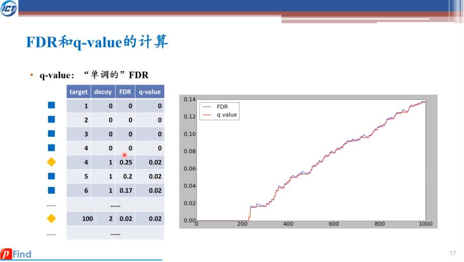

# pFind 3

### Software usage

How to employ a database search with pFind 3?

> Please refer to 25:50 of the lecture

How to check the identified peptides with pBuild?

> Please refer to 32:50 of the lecture

How to check the chromatogram of peptides with pBuild?

> Please refer to 34:20 of the lecture

How to check the coverage of proteins with pBuild?

> Please refer to 34:50 of the lecture

### Database search procedure

What is the purpose of the preprocessing of MS spectra?

> To correct the precursor mass (m/z) and to detect co-eluted precursors.

What is the purpose of the preprocessing of MS/MS spectra?

> To remove noise peaks and isotopic peaks. (Isotopic peaks are not actually noise peaks. They can reveal much information for a search engine. When the peaks are deleted, the information has already been recorded.)

What is the purpose of the preprocessing of the database?

>

How is peptide-sequence match (PSM) searched given preprocessed database?

>
Note: Here we look into spectra for each modified peptide. The reason is that the number of peptide sequences is usually less than the number of spectra. Otherwise, we can look into modified peptides for each spectrum, which is commonly used in open mode search.

What is Q value? Why is it introduced?

>

What are common ways to infer proteins? How does FDR change when inferring proteins from peptides?

>

### Open search
What is the main idea of open search?

>

What is the workflow of Open-pFind?

>
