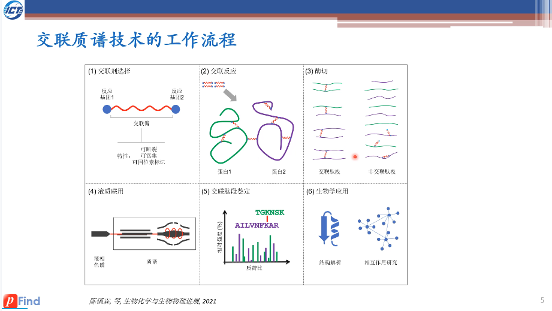
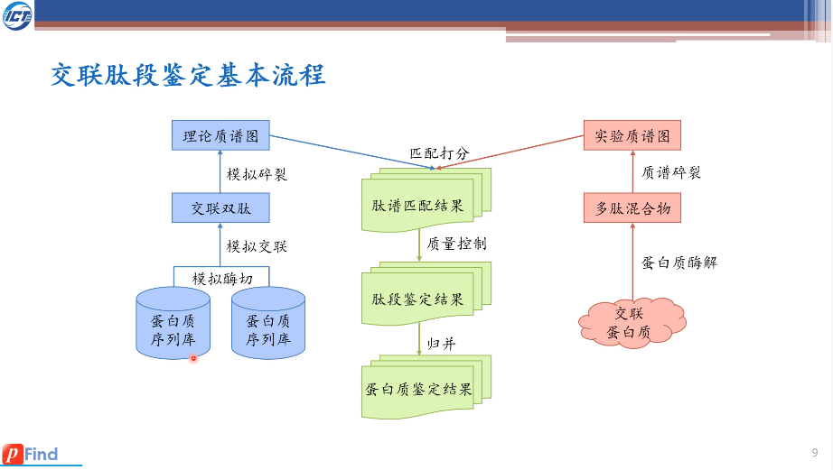
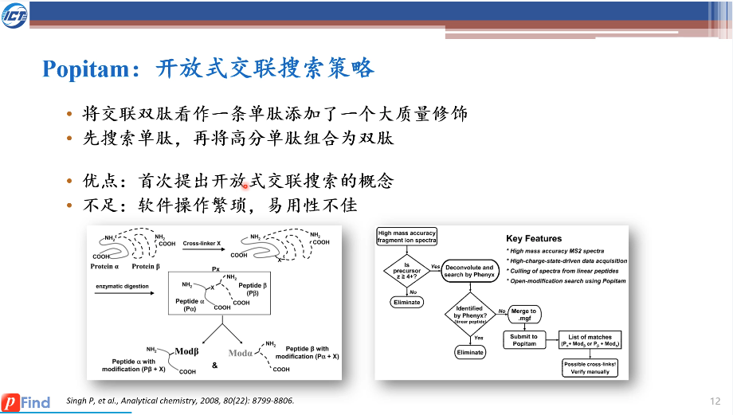
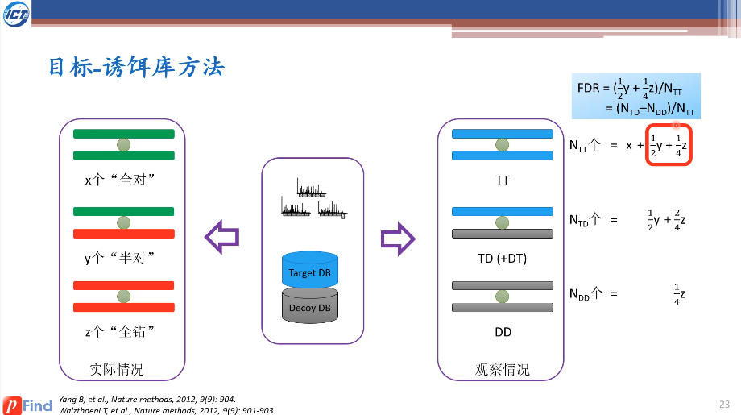
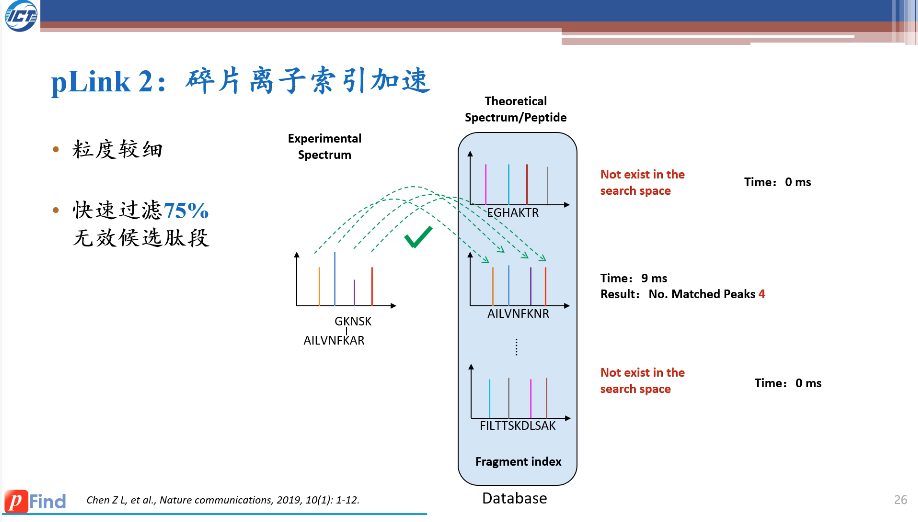
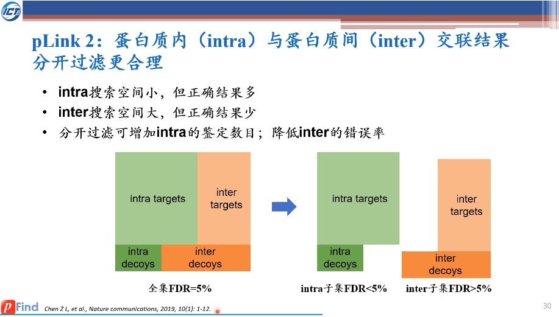

# pLink 2

### Software usage

How to employ a database search with pLink 2?

> Please refer to 29:10 of the lecture

How to check the identified cross-linked spectra in the .csv file? What about cross-linked peptides and sites?

> Please refer to 39:30 of the lecture

How to read the peptide-spectrum match details with pLabel?

> Please refer to 42:00 of the lecture

### Cross-linked database search procedure

What is the typical procedure for the preparation and identification of a cross-linked protein sample?

> 

What is the brief procedure for a cross-linked protein database search engine to identify MS/MS data?

> 

How does open search used in the identification of cross-linked peptides?

> 

How is TDA-FDR transferred into cross-linked peptides?

> 

How is fragment index used in the speed-up of pLink 2?

> 

Why employing separate FDR for inter and intra cross-linked protein results?

> 
