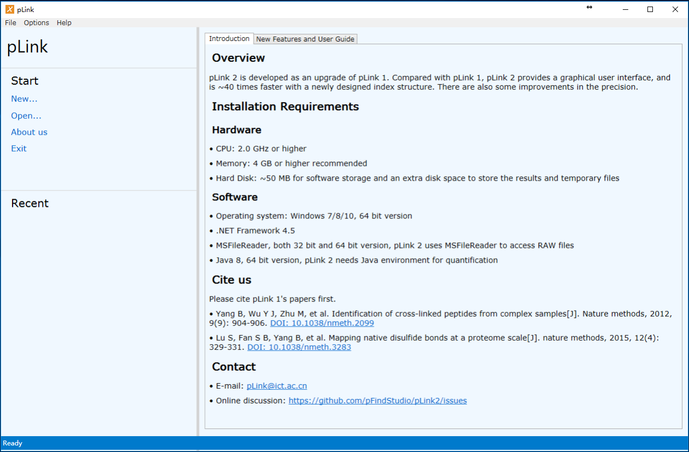
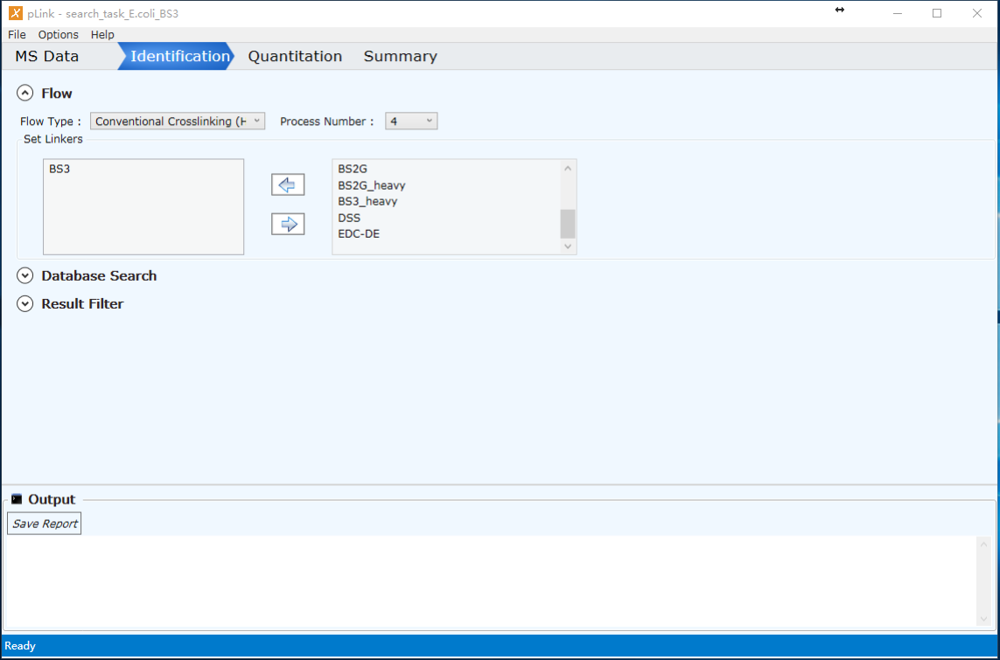
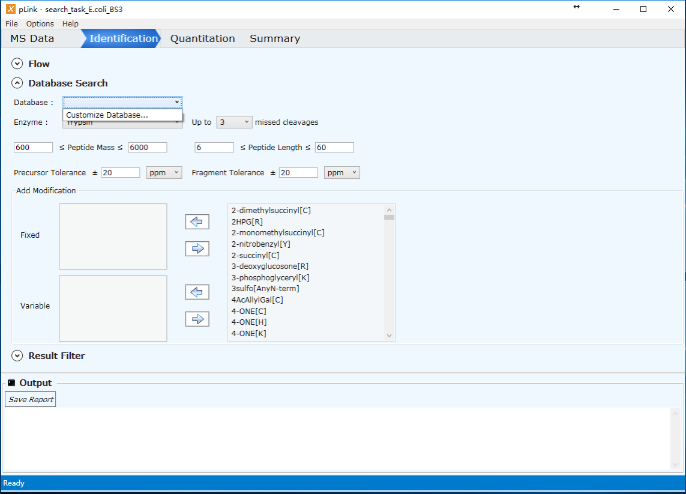
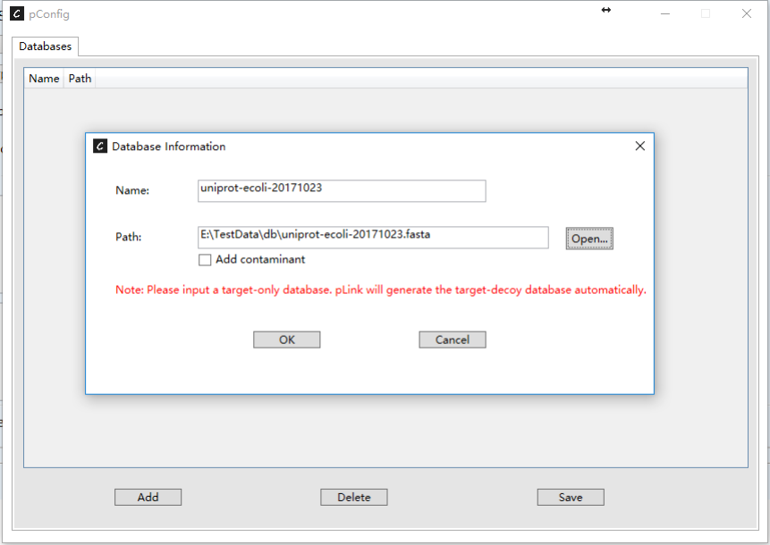
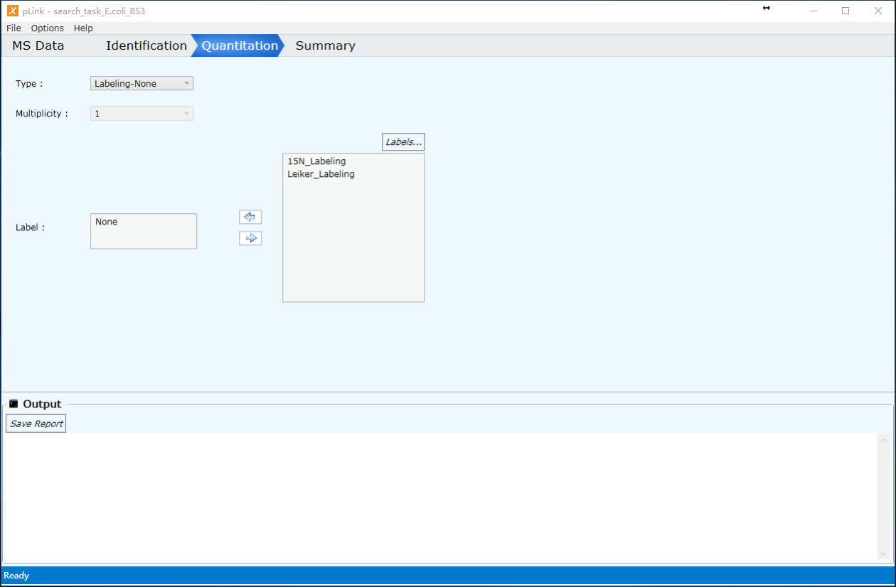
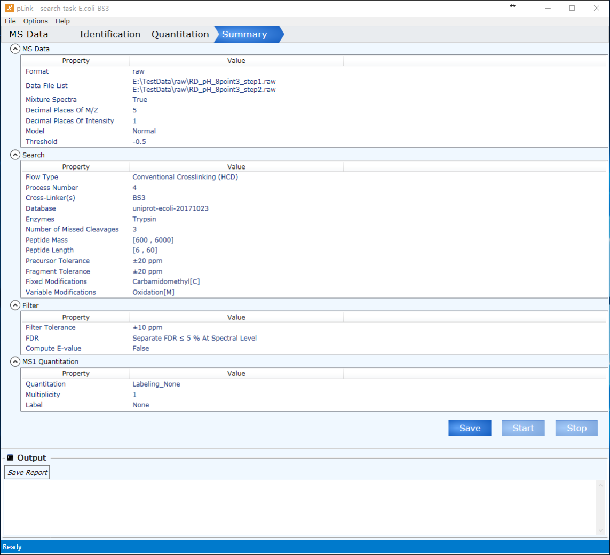

# How to use pLink 2
## Create a new task
Open pLink 2 and you can see the main interface.Click on "New..." under the "Start" label to create a new task.

## Step 1: Load MS Data

### Data File List

First select the format of the MS data, and then click "Add" button to browse and select data. pLink  supports MS data of `.raw`, `.mgf` and `.pf2`.

### Data Extraction

Set the extraction of data. **Default setting is recommended.**

Place of Decimals: the precision of MS data.

Precursor Score: these are parameters for pParse 2.

By clicking "Mixture Spectra" we allow the detection of multiple results from one spectrum.

## Step 2: Set search parameters

### Flow

Flow Type: supports conventional crosslinking (HCD mode) and Disulfide Bond (HCD mode). Choose the former one for the search of conventional crosslinker and the latter one for the search of disulfide bond.

Process Number: the allowed number of CPU process for the task. Do not recommend the number to be greater than the total number of logical CPU process of the computer.

Set Linkers: choose the linker used for the data.

### Database Search

#### Select database

Database: add fasta database for the search.

Add a database: by clicking "Customize Database", pConfig will be called for adding a new database. Click "Add" in pConfig, browse and select a fasta database, rename the database, and click "Save" before close pConfig. By clicking "Add contaminant" we add common contaminant that sometimes occur during the preparation of the sample.

#### Enzyme

Choose the enzyme used in the sample preparation.

#### Peptide filter parameters

Set the appropriate peptide mass range (in Da), peptide length 
range and error range.

#### Modifications

Set the modifications that you wish to consider during the search.

Fixed modifications: fix the modification to all of this amino acid.

Variable modifications: consider at most three sites in each sequence to have a modification listed in the variable modifications.

### Result Filter

Filter tolerance: the tolerance to keep results.

FDR: remove results that are below FDR threshold. By choosing separate FDR, pLink filter inter-protein and intra-protein results separately.

By clicking "Compute E-value", pLink will calculate the expetation value for every result. As it is time-consuming, by default it is unchecked.

## Step 3: Set quantification parameters

15N labeling and Leiker labeling are supported if necessary

## Step 4: Run task

Check the search parameters, save and start the task. You can change parameters later by loading the task again. Once the task is started, you can see the logging in the output panel. The report will pop out when the task is finished.

## FAQ

If you meet any problem, visit [http://forum.pfind.org/forum](http://forum.pfind.org/forum) to reach for us.
